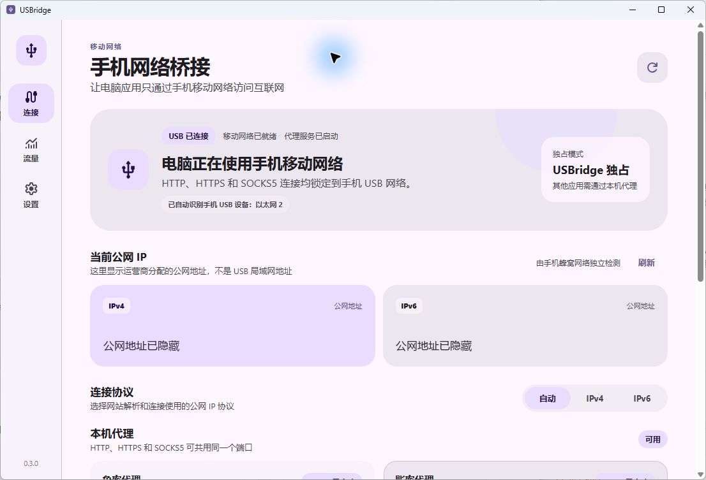
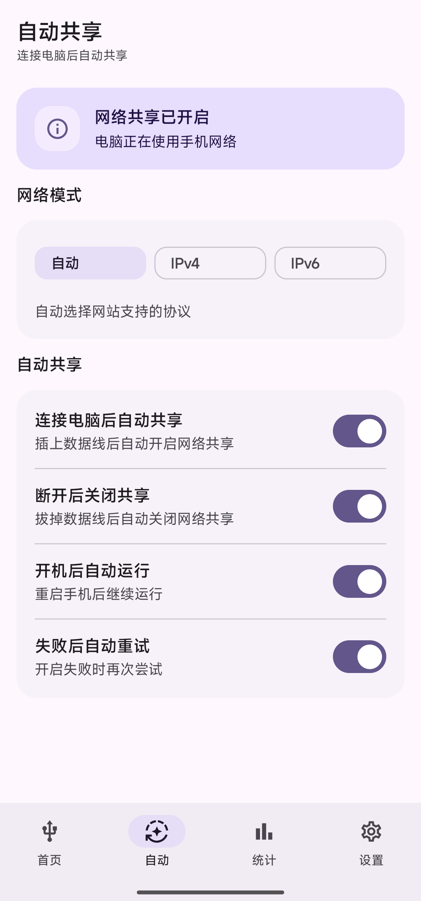

# USBridge

**简体中文** | [English](README_EN.md)

让 Windows 通过 Android 手机的 USB 共享网络上网，并把这条网络作为 HTTP / SOCKS5 代理提供给本机软件。

手机端和电脑端配套使用，目前支持 **Android 11+（需要 Root）** 和 **Windows 10 / 11 x64**。

## 界面

### Windows



### Android



## 下载

从 [Releases](https://github.com/jmcgillcoder/USBridge/releases/latest) 下载同一版本的 Android APK 和 Windows EXE。

- 手机安装 APK，首次启动时授予 Root 权限
- 电脑运行 EXE，不需要安装
- Windows 文件尚未使用商业代码签名证书，首次运行可能出现 SmartScreen 提示
- 后续版本可在两端的设置页直接检查和安装

## 怎么用

1. 用数据线连接手机和电脑。
2. 打开手机端 USBridge，开启 USB 网络共享；也可以在设置里启用“连接 USB 后自动开启”。
3. 打开 Windows 端，等它识别出手机的 USB 网卡。
4. 在需要走手机网络的软件里填写代理地址。

| 用途 | 地址 | 账号 |
| --- | --- | --- |
| HTTP / SOCKS5 | `127.0.0.1:18080` | 无 |
| HTTP / SOCKS5 | `127.0.0.1:18081` | `usbridge` / `usbridge_pw` |

两个端口都同时支持 HTTP、HTTPS CONNECT 和 SOCKS5，不会在手机网络断开时偷偷改走电脑原来的 Wi-Fi 或网线。

## 换 IP

Windows 端的“重新联网”会让手机重新连接移动网络，然后比较操作前后的公网 IPv4 / IPv6。运营商是否分配新地址由运营商决定，所以软件会分别显示“网络已恢复”和“公网 IP 是否变化”，不会把重连成功当成换 IP 成功。

出口模式有“自动、IPv4、IPv6”三种。这里控制的是代理连接使用哪种地址族，不会凭空给只提供 IPv6 的电话卡生成 IPv4。

## 严格代理模式

默认情况下，没有设置代理的软件仍可能直接使用手机的 USB 网卡。

开启“严格代理模式”后，USBridge 会自动把 Windows 系统 HTTP / HTTPS 代理设为 `127.0.0.1:18080`，同时限制其他软件直接使用手机 USB 网卡。Chrome、Edge 等支持系统代理的软件无需单独设置；忽略系统代理的软件仍需手动填写 `18080` 或 `18081`。关闭模式或退出 USBridge 时，原来的系统代理设置会自动恢复。

## 本机接口

Windows 端在 `http://127.0.0.1:18082` 提供控制接口，只监听本机且不需要鉴权。接口清单可直接读取：

```powershell
curl.exe http://127.0.0.1:18082/v1/help
```

例如重新连接移动网络：

```powershell
curl.exe -X POST -H "Content-Type: application/json" -d "{}" http://127.0.0.1:18082/v1/mobile/reconnect
```

## 兼容性

手机端通过 [libsu](https://github.com/topjohnwu/libsu) 请求 Root，不绑定某一个 Root 管理器。Magisk、KernelSU、APatch 以及其他兼容实现都可以尝试；具体的移动数据和 USB 共享命令仍会受手机厂商 ROM 影响。

流量统计保存在手机和电脑本地。手机控制服务只接受来自 USB 共享接口的请求，电脑端代理和控制接口只监听 `127.0.0.1`。

## 从源码构建

需要 JDK 21、Android SDK 36.1、Go 1.25、Node.js 22 和 npm。

```powershell
# Android
.\gradlew.bat test assembleDebug

# Windows 后端
Set-Location desktop
go test ./...
go vet ./...

# Windows 前端
Set-Location frontend
npm ci
npm run build
```

Wails 正式构建和发布签名见 [docs/RELEASING.md](docs/RELEASING.md)。问题反馈请使用 [Issues](https://github.com/jmcgillcoder/USBridge/issues)，安全问题请按 [SECURITY.md](SECURITY.md) 私密报告。

## License

[Apache License 2.0](LICENSE)
